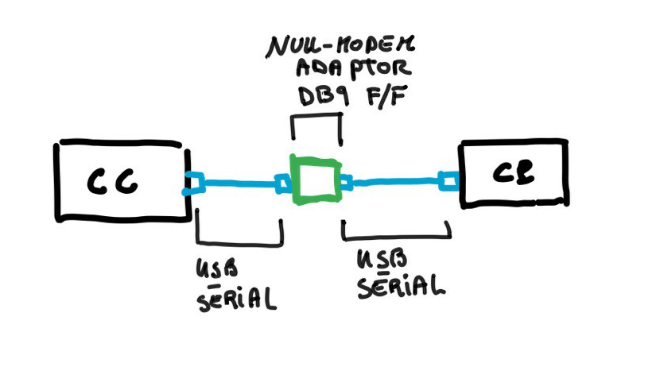

# Cuis-Smalltalk-SerialPort
This package provides serial port communication to Cuis Smalltalk. The [serial port](https://en.wikipedia.org/wiki/Serial_port) is probably the simplest way to make two machines communicate, it is very common even today, when nothing works probably a serial console can save your day. I repackaged existing code, tested it and wrote this little document. For the origins see the *History & Changelog* section. 
**CAVEAT**. This code was tested only with Cuis running in *Linux*. 

# Test & mini HowTo 

* Install the package in the usual way, in serial communication it it very frequent to use the '\n', '\t'
and '\c' special characters. For this reason I will also load **Printf**.

```smalltalk
Feature require: 'SerialPort'.
Feature require: 'Printf'.
```

* Then, to do a realistic test, one that mirrors a real life use case for the serial port, you will need some hardware:
  * Two computers, I use Linux in both. 
  * 2 USB-serial adaptors. Be warned, not all USB-serial work well together, if you want to be 100% sure
    it will all work just buy two of the same brand and model. 
  * A **null-modem adaptor** (for example [this](https://www.amazon.it/StarTech-com-Adattatore-Modem-Seriale-RS-232/dp/B000DZH4V0/ref=sr_1_17?keywords=null+modem&qid=1639180837&sr=8-17) which I am using right now). Or you can make your own if you are familiar with the soldering iron.
  * On one computer we will talk with Cuis-Smalltalk, in the other we will Python.
    
* Let's call **CP** the computer that will comunicate with Python and **CC** the computer that will comunicate via Cuis.

* This is the connection scheme (made with the powerfull *NiCad*).
  
 </img>

* Plug a USB-serial adaptors in each of your computers and check out the last lines in `$> sudo dmesg`, you should 
  see the name given to the newly connected widget device, to me it is `/dev/ttyUSB0` in both computers.
  

* Prepare the serial in Python

```python
# in a shell of CP do 
$> python3 
>>> import serial      # if you don't have this package you need to install it
>>> serP = serial.Serial("/dev/ttyUSB0", baudrate=19200, bytesize=8, parity='N', stopbits=1, timeout=None, xonxoff=0, rtscts=0) 
```

* Prepare the serial in Cuis and send a message. Remember to take a look into **SerialPort>>initialize** there 
are defined the default communication settings for a serial port. Most of the times you need to modify only
the connection speed, that is what we will do here.

```smalltalk
" in Cuis-Smalltalk Workspace of CC do "
serC _ SerialPort new. 
serC baudRate: 19200.
serC openPort: '/dev/ttyUSB0'. 
serC nextPutAll: ('Hello from Cuis, who is there ? \n' printf: {}). 
```

* Receive the message in Python and send a messagge back

```python
>>> serP.readline()
b'Hello from Cuis, who is there ?\n'
serP.write(b"Hello Cuis, here is Python, what's up ? \n")
```

* Read the message in Cuis then close the port, rats do not like much snakes.

```smalltalk
serC readString .  " => ' Hello Cuis, here is Python, what''s up ? 
' "
serC close.
```


* That's it! We saw we are able to make our Cuis read and write over the serial line with another computer 
running another programming language. 

* Exercise.1. Try to communicate with **minicom** instead of Python.
* Exercise.2. Try to connect 2 USB-serial to only one computer and e.g. let two Cuis instances it talk themselves.


# History & Changelog
* On 10-Dec-2021 I was born as a repackaging of **G. Arduino** software available [here](https://github.com/garduino/Cuis-Smalltalk-Miscellaneous). *Mr. Arduino* several years ago kindly adapted the existing *Squeak* code to *Cuis*. 
